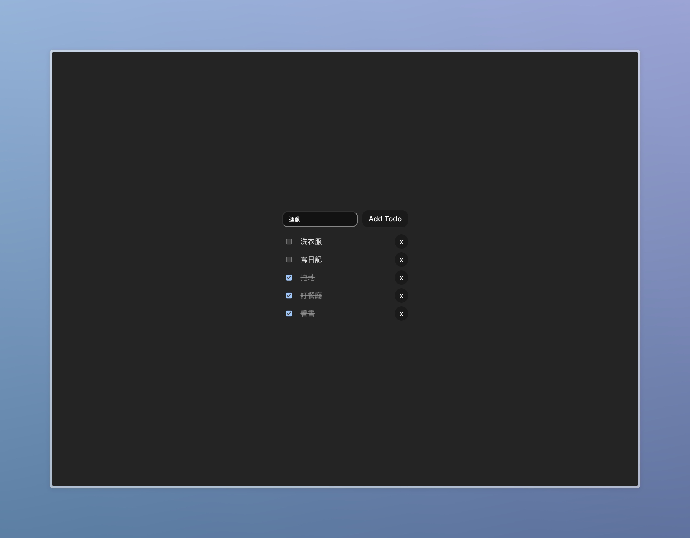

# Vue Todo App

這是一個使用 Vue 3 + TypeScript + Vite 開發的待辦事項應用程式。本專案主要目的是透過實作一個 Todo App 來深入學習 Vue 3 的各項功能，特別是 Composition API 的應用和 Pinia 的狀態管理。

## 目錄

- [概覽](#overview)
  - [Screenshot](#screenshot)
  - [Links](#links)
- [技術應用](#技術應用)
- [專案結構](#專案結構)
- [功能特色](#功能特色)
- [開發心得](#開發心得)
- [未來規劃](#未來規劃)

## 概覽

### Screenshot



### Links

- Github URL: [Code](https://github.com/yyuntzpan/vue-todos-app.git)
- Live Site URL: [To-do App](https://vue-todos-app-sooty.vercel.app/)

## 技術應用

本專案採用了以下技術框架與工具：

- Vue 3：使用 Composition API 進行開發
- TypeScript：增加型別安全和開發體驗
- Vite：享受快速的開發環境和建置效能
- Pinia：進行狀態管理，提升資料流的可維護性

## 專案結構

專案採用組件化的結構設計，主要包含以下組件：

```
src/
├── components/
│ ├── TodoInput.vue # 待辦事項輸入組件
│ ├── TodoItem.vue # 單一待辦事項組件
│ └── TodoList.vue # 待辦事項列表組件
├── stores/
│ └── todo.ts # Pinia 狀態管理
└── App.vue # 根組件
```

## 功能特色

- 待辦事項的新增與刪除
- 任務完成狀態的切換
- 已完成任務的自動排序
- 基於 Vite 預設樣式的 UI 優化

## 開發心得

在開發過程中，我遇到了一些挑戰並學習到寶貴的經驗：

- 使用 Composition API 重新思考組件的邏輯組織
- 透過 Pinia 進行狀態管理，理解集中式數據流的優勢
- 組件拆分的原則與實踐
- TypeScript 在 Vue 專案中的應用

## 未來規劃

- [ ] 實作本地儲存功能 (LocalStorage)
- [ ] 整合雲端儲存功能 (例如 Firebase)
- [ ] 加入任務分類功能
- [ ] 新增任務截止日期
- [ ] 優化使用者介面
- [ ] 加入任務優先級設定
